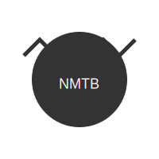

# NEVER MIND THE BOLLARDS

  <picture>
    <source media="(prefers-color-scheme: dark)" srcset="assets/logo-dark.svg">
    <source media="(prefers-color-scheme: light)" srcset="assets/logo-light.svg">
    
  </picture>

##  _(...a  little less "Anarchy in the parking lot"..._)

## ABOUT THE PROJECT

**NEVER MIND THE BOLLARDS** is a 3D printable bollard cap designed to cover those ugly metal pipes sticking out of parking lots. Because even parking infrastructure deserves a proper punk makeover.

Born out of necessity and a love for DIY culture, this project aims to turn boring parking bollards into something worth looking at. No more dented, rusty eyesores - just pure, unadulterated BOLLARD STYLE.

## THE DIY ETHOS

The spirit of '77 lives on in this project. We believe in:

- **DO IT YOURSELF** - Print it. Modify it. Make it your own.
- **DO IT TOGETHER** - Share your remixes, improvements, and wild variations.
- **QUESTION AUTHORITY** - Who says parking lot infrastructure has to be boring?

This isn't just a bollard cap, it's a statement. A tiny rebellion against the mundane. A small act of creative defiance in the concrete jungle.

## FEATURES

- Designed in OpenSCAD for maximum hackability
- Fits standard parking bollard pipes (measurements in the specs)
- Weather-resistant when printed in appropriate materials
- Looks way cooler than a naked pipe
- Easy to customize for your own anarchic vision

## NO PARKING IN THE DANCE AREA

This project is open for collaboration. Fork it. Remix it. Print it. Share it.

We welcome:
- Design improvements
- Material experiments
- Wild customizations
- Installation photos from the wild

## GOD SAVE YOUR PARKING SPOT

Standard sizes are available, but the OpenSCAD file makes customization easy. Measure your bollard, adjust a few parameters, and you're ready to print your own perfect fit.

## LICENSE

Released under Creative Commons [CC BY-SA 4.0](https://creativecommons.org/licenses/by-sa/4.0/)

Share — copy and redistribute the material in any medium or format
Adapt — remix, transform, and build upon the material for any purpose, even commercially.

## INSTALLATION MANIFESTO

1. Measure your target bollard
2. Print the appropriate size (or customize your own)
3. Snap/fit onto bollard
4. Post pictures with #NeverMindTheBollards
5. Watch as your parking lot subtly becomes more punk

---

_"We're not here to be pretty, we're here to be seen."_